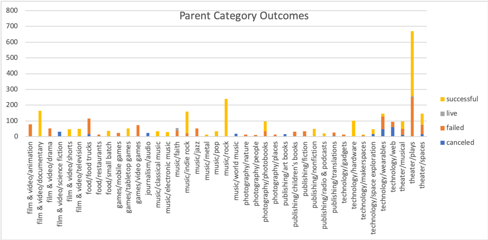
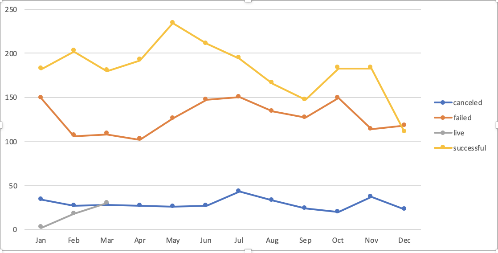
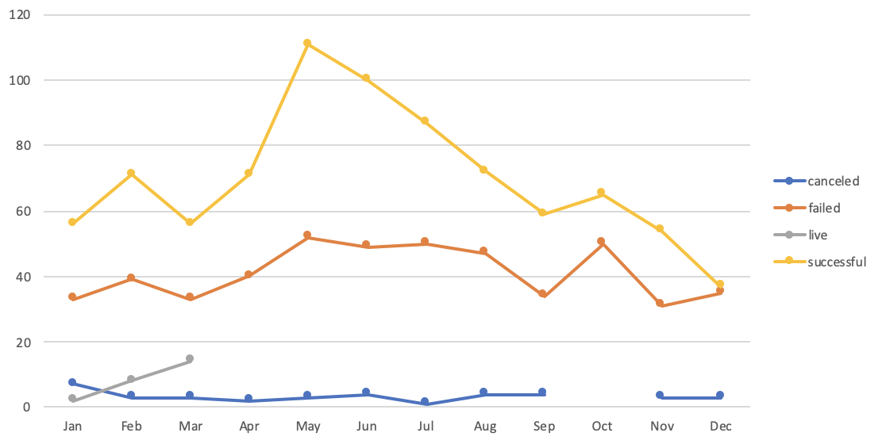
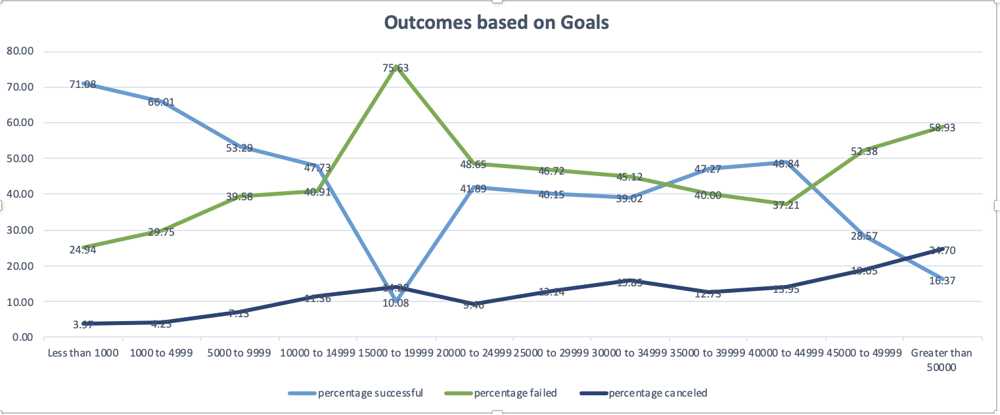

# An Analysis of Kickstarter Campaigns
## Goal: To perform an analysis on campaign kickstarter data to uncover trends

### Most Successful Category
- This analysis shows that Theater/Plays has the most successful statistics

### Best month to launch a campaign
- This analysis shows that May is the best month to launch a campaign

### Challenge
- This analysis shows whether the length of a campaign contributes to its success.

1. Outcome based on Launch Date (theater category):
- This illustration shows that campaign that gets launch in May have higher success than campaigns that are launched in December.

- This illustration shows that campaign whose goals are between $1000 and less than $5000 are more successful. On the other hand, campaigns whose goals are between $15,000 and less than $20,000, or exceeds $50,000 is more likely to fail. Campaigns whose goal is greater than $50,000 is more likely to get canceled.

  
